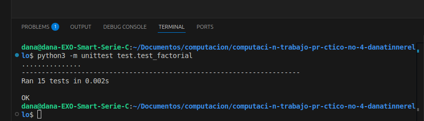

# Implementación de Factorial

## Descripción del problema

Este proyecto implementa la función matemática factorial utilizando dos enfoques diferentes:

1. **Método Iterativo**: Calcula el factorial mediante un bucle (for/while)
2. **Método Recursivo**: Calcula el factorial llamándose a sí mismo con parámetros más pequeños

El factorial de un número entero positivo n (denotado como n!) se define como el producto de todos los enteros positivos desde 1 hasta n:

n! = n × (n-1) × (n-2) × ... × 2 × 1

Por definición, 0! = 1

El programa maneja adecuadamente las siguientes situaciones:
- Entrada que no es un número (muestra mensaje de error)
- Número negativo (muestra mensaje de error ya que el factorial solo se define para números no negativos)
- Caso especial del cero (devuelve 1)
- Números muy grandes (maneja posibles excepciones de desbordamiento o recursión)


## Instrucciones de ejecución

### Requisitos previos

- Python 3.6 o superior

### Instalación

1. Clona este repositorio:
```bash
git clone https://github.com/usuario/factorial-implementation.git
cd factorial-implementation
```

2. No se requieren dependencias adicionales.

### Ejecución

```bash
python factorial.py
```

El programa te pedirá ingresar un número para calcular su factorial.

### Ejecutando los tests

```bash
python test_factorial.py
```

## Ejemplos de uso

### Como módulo importado

```python
from factorial import factorial_iterativo, factorial_recursivo

# Método iterativo
print(factorial_iterativo(5))  # Output: 120

# Método recursivo
print(factorial_recursivo(5))  # Output: 120

# Manejo de errores
print(factorial_iterativo(-5))  # Output: "Error: No se puede calcular el factorial de un número negativo"
print(factorial_recursivo("abc"))  # Output: "Error: Por favor ingresa un número válido"
```

## Capturas de pantalla de los tests ejecutados




*Figura 1: Ejecución exitosa de los tests unitarios para las implementaciones de factorial*

