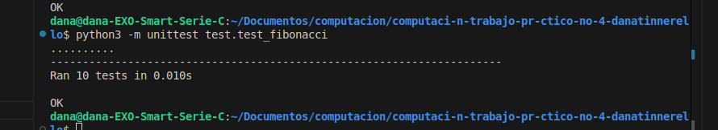

# Función Fibonacci

## Descripción del problema

La secuencia de Fibonacci es una serie matemática donde cada número es la suma de los dos anteriores. Comienza con 0 y 1, y continúa indefinidamente:

0, 1, 1, 2, 3, 5, 8, 13, 21, 34, 55, 89, 144, ...

Matemáticamente, la secuencia de Fibonacci F(n) se define como:
- F(0) = 0
- F(1) = 1
- F(n) = F(n-1) + F(n-2) para n > 1

Este proyecto implementa una función que calcula el número de Fibonacci en la posición n especificada.

## Instrucciones de ejecución

### Requisitos previos
- Python 3.x instalado en tu sistema

### Instalación
1. Clona este repositorio o descarga los archivos en tu máquina local
2. Navega hasta el directorio del proyecto

### Ejecución
Para utilizar la función Fibonacci en tu propio código:

```python
from fibonacci import fibonacci

# Calcula el 10° número de Fibonacci
resultado = fibonacci(10)
print(resultado)  # Imprimirá: 55
```

### Ejecutar tests
Para ejecutar los tests automatizados:

```bash
python -m unittest test_fibonacci.py
```

## Ejemplos de uso

### Ejemplo básico

```python
from fibonacci import fibonacci

# Calcular los primeros 10 números de la secuencia
for i in range(10):
    print(f"Fibonacci({i}) = {fibonacci(i)}")
```

Salida:
```
Fibonacci(0) = 0
Fibonacci(1) = 1
Fibonacci(2) = 1
Fibonacci(3) = 2
Fibonacci(4) = 3
Fibonacci(5) = 5
Fibonacci(6) = 8
Fibonacci(7) = 13
Fibonacci(8) = 21
Fibonacci(9) = 34
```


## Capturas de pantalla de los tests ejecutados



*Fig 1: Tests verificando la correcta implementación de la función Fibonacci*


