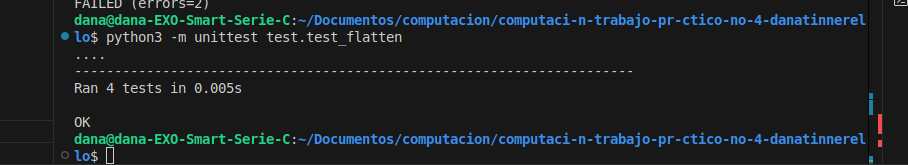

# Función Aplanar Listas

## Descripción del problema

La función `aplanar` está diseñada para transformar una lista con múltiples niveles de anidamiento en una lista plana (de un solo nivel). La función debe ser capaz de manejar listas con cualquier nivel de profundidad y con elementos de cualquier tipo, incluyendo números, cadenas, booleanos, y otras listas.

El problema consiste en recorrer recursivamente la lista de entrada, identificando cualquier elemento que sea una lista anidada y extrayendo sus elementos para incluirlos en una única lista resultante.


## Instrucciones de ejecución

1. Asegúrate de tener Python instalado en tu sistema.
2. Guarda la función `aplanar` en un archivo Python (por ejemplo, `aplanar.py`).
3. Importa la función en tu código o utilízala directamente desde el archivo:

```python
from aplanar import aplanar

# Ejemplo de uso
lista_anidada = [1, [2, 3], [4, [5, 6]]]
lista_plana = aplanar(lista_anidada)
print(lista_plana)  # Output: [1, 2, 3, 4, 5, 6]
```

Para ejecutar los tests:
```bash
python -m unittest test_aplanar.py
```

## Ejemplos de uso

### Ejemplo 1: Lista con múltiples niveles de anidamiento
```python
lista = [1, [2, [3, 4], 5], [6, 7]]
resultado = aplanar(lista)
print(resultado)  # Output: [1, 2, 3, 4, 5, 6, 7]
```

### Ejemplo 3: Lista vacía y listas anidadas vacías
```python
lista = [[], [[], []], [1, []]]
resultado = aplanar(lista)
print(resultado)  # Output: [1]
```


## Capturas de pantalla de los tests ejecutados



*Nota: La captura de pantalla anterior muestra la ejecución de los tests definidos, todos ellos pasando correctamente.*

